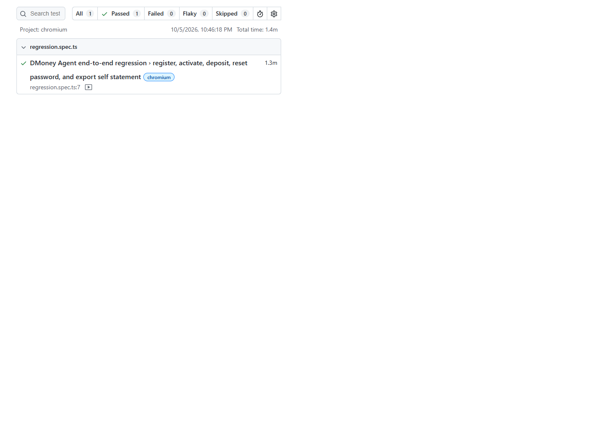
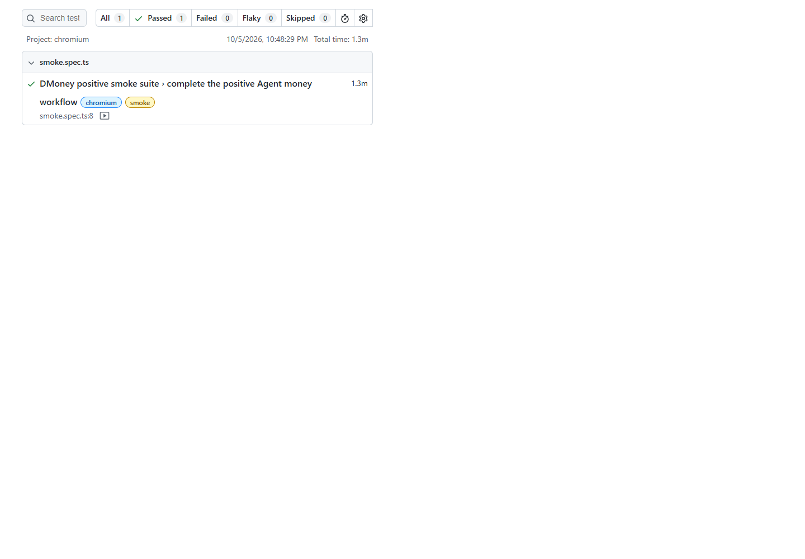

# DMoney Portal Playwright Assignment

<div align="center">


</div>

A complete end-to-end QA automation project for the dMoney portal assignment, built with TypeScript, Playwright, and the Page Object Model. The workflow follows the real live business flow, including registration, admin activation, system funding, customer deposit, password reset, and statement export.

## Table of Contents

- [Project Overview](#project-overview)
- [Workflow Coverage](#workflow-coverage)
- [Technology Stack](#technology-stack)
- [Project Structure](#project-structure)
- [Setup](#setup)
- [Run the Tests](#run-the-tests)
- [Evidence for Submission](#evidence-for-submission)
- [Notes](#notes)
- [👨‍💻 Author](#-author)

## Project Overview

This project automates the full assignment flow for the dMoney QA practice platform. It validates critical user journeys and ensures the app behaves correctly under real portal conditions, including Gmail OTP handling and reset-password flow validation.

The implementation follows a clean structure:

- Page Object Model for maintainable interaction logic
- Tagged suite execution for regression and smoke scenarios
- Real browser automation with headed Chromium runs
- Video capture and screenshot evidence for submission
- CSV export verification for customer statements

## Workflow Coverage

The regression scenario validates the complete assignment flow:

- Register a new Agent
- Confirm the Agent is pending in the Admin user list
- Activate the Agent and verify persistence after reload
- Deposit Tk 2,000 from System to the Agent
- Verify the resulting Agent balance
- Deposit Tk 500 to an existing Customer
- Verify the transaction result and recalculated balance
- Reset the Agent password
- Confirm the old password is rejected
- Log in with the new password
- Export all Self Statement pages to CSV

If a customer rejects the deposit because of an account limit, the workflow automatically retries with another valid customer account from the Admin user list.

The smoke scenario runs the positive flow without the intentional old-password rejection check.

## Technology Stack

- Playwright
- TypeScript
- Node.js 20+
- Gmail API / OAuth for OTP and reset-link retrieval
- CSV generation for self-statement export
- GitHub-style documentation and evidence archive

## Project Structure

```text
Playwright-assignment/
├── pages/
│   ├── AdminUsersPage.ts
│   ├── LoginPage.ts
│   ├── MoneyPage.ts
│   ├── PasswordResetPage.ts
│   ├── RegistrationPage.ts
│   └── StatementPage.ts
├── tests/
│   └── workflow.ts
├── utils/
│   ├── gmail.ts
│   └── workflowData.ts
├── docs/
│   └── evidence/
├── output/
├── .env.example
├── .gitignore
├── package.json
├── playwright.config.ts
├── README.md
└── Assignment description.txt
```

## Setup

1. Install Node.js 20 or newer.
2. Run:

```sh
npm install
npx playwright install chromium
```

3. Copy `.env.example` to `.env` and configure the required credentials.
4. Set `AGENT_EMAIL` to a Gmail inbox you control.
5. Configure `GMAIL_CLIENT_ID`, `GMAIL_CLIENT_SECRET`, and `GMAIL_REFRESH_TOKEN` for that same inbox with Gmail read-only scope and offline access.
6. If needed, set optional `CUSTOMER_ACCOUNT` to target a specific customer.
7. Adjust `AGENT_INITIAL_PASSWORD` and `AGENT_NEW_PASSWORD` if your portal password policy requires changes.

> The Admin and System defaults are the assignment credentials. Refresh credentials allow Google OAuth to renew expired access tokens during later runs. `GMAIL_ACCESS_TOKEN` is only a temporary fallback and expires quickly. Keep all Gmail OAuth credentials in `.env` and do not commit them.

## Run the Tests

```sh
npm test
npm run test:regression
npm run test:smoke
npm run test:headed
npm run report
```

Tests run in headed Chromium mode and record video. Playwright reports and videos are stored under ignored `playwright-report/` and `test-results/` folders. Extracted statements are written to `output/self_statement_YYYY-MM-DD.csv`.

Last successful extracted statement:

- [output/self_statement_2026-10-05.csv](output/self_statement_2026-10-05.csv)

## Evidence for Submission

The passing regression and smoke evidence below was captured on 2026-10-05.

<div align="center">
  <table>
    <tr>
      <td align="center">
        <strong>Regression Test Result</strong><br>
        
      </td>
      <td align="center">
        <strong>Smoke Test Result</strong><br>
        
      </td>
    </tr>
  </table>
</div>

### Headed Run Video

- [Regression video](docs/evidence/regression-video.webm)
- [Positive-only smoke video](docs/evidence/smoke-video.webm)

The selected evidence is kept in `docs/evidence/`. Temporary Playwright reports and run artifacts are intentionally ignored.

## Notes

- The live portal requires a mailbox-controlled Gmail address for agent login OTPs and password reset URLs.
- A valid Customer account is required for the Tk 500 deposit flow.
- The workflow creates a Gmail plus-alias for unique Agent registration.
- It tries multiple Customer accounts from the Admin user list until one accepts the deposit.
- Optional `CUSTOMER_ACCOUNT` can be set to target one specific account.

## 👨‍💻 Author

Abdullah Al Mahmud Joy

Full Stack SDET — Road to SDET

M.Sc. in Computer Science & Engineering, Military Institute of Science and Technology (MIST)

B.Sc. in Computer Science & Engineering, Bangladesh University of Business and Technology (BUBT)

- GitHub: https://github.com/almahmudjoy
- LinkedIn: https://linkedin.com/in/abdullah-al-mahmud-joy

---

This project is a practical automation exercise built to validate real-world end-to-end web flows using Playwright, with emphasis on measurable QA evidence and assignment coverage.